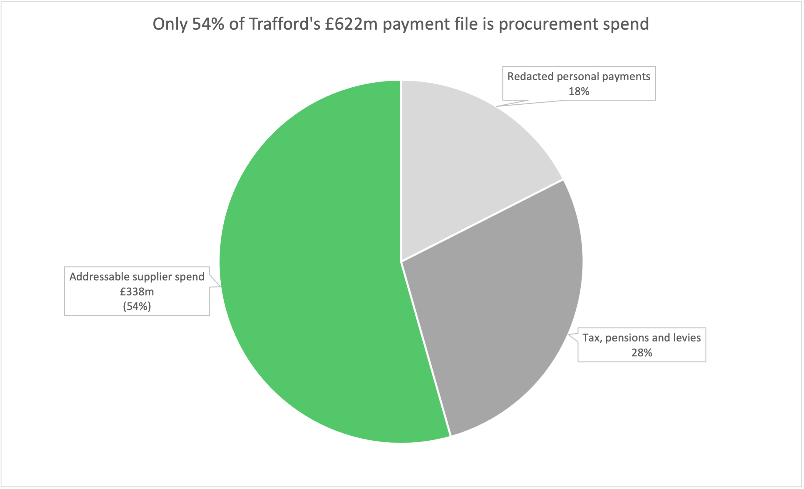
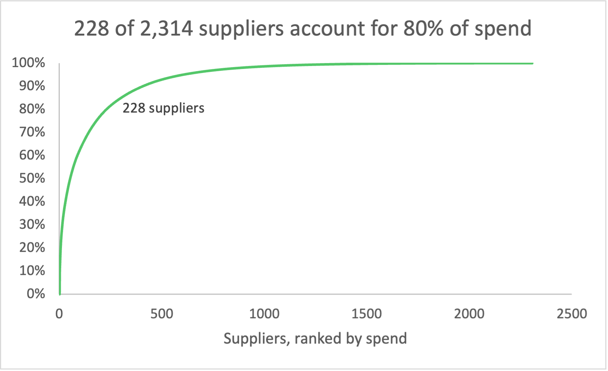

# What a council actually buys

A spend analysis of Trafford Council, FY 2025-26

Trafford Council publishes every payment it makes to suppliers. I took one year of that file, 241,764 transactions, and rebuilt it into a spend cube. That is the first thing a procurement team does on a new client: work out who you really buy from, what you buy, and where the money sits.

Data: Trafford Council supplier spend, April 2025 to March 2026, from data.gov.uk under the Open Government Licence. Python and pandas for the pipeline, Excel for the charts.

## Half the file is not procurement spend



Gross payments were £677.8m. Credit notes of £55.9m bring that down to £621.9m net.

Then £283.6m drops out, because it is not spend anyone in procurement can influence:

- £113m of redacted personal payments, mostly care recipients and benefit claimants
- £73m levy to the Greater Manchester Combined Authority
- £50m to HMRC
- £51m in pension contributions

That leaves £338.3m of real supplier spend. Everything below is measured against that number, not the headline £622m.

This matters more than it sounds. Anyone reading the published file at face value would size the opportunity at nearly twice what exists.

## The same company shows up more than once

The file has 2,406 different supplier names across 2,409 vendor records. After matching on VAT registration number, there are 2,314 actual companies. So 95 vendor records are duplicate registrations of a supplier the council already had, and 69 companies appear under more than one spelling.

Matching on VAT rather than on name caught things name-matching would miss, where the same legal entity is set up twice under different trading names.

One thing worth flagging, because it nearly went unnoticed: a vendor record often carries a VAT number on some invoices and leaves it blank on others. My first attempt keyed those rows differently and split single suppliers in two, which pushed the supplier count up instead of down. I resolve one VAT number per vendor record first, then apply it across all of that record's rows.

## A tenth of suppliers hold four fifths of the money



228 suppliers out of 2,314 account for 80% of addressable spend. They also generate 74% of the invoices.

At the other end, 1,633 suppliers are paid less than £50,000 a year. Together they are 4% of spend and 10% of the invoices, at an average invoice of £870.

Every one of those small suppliers still has to be set up, checked, invoiced and paid. Most of the administrative cost of running procurement here comes from companies that account for almost none of the money.

## Social care is not just the biggest category, it is nearly half

Social care is £174.1m, 45% of addressable spend, spread across 671 suppliers and 129,288 invoices. No other category comes close. Education is next at £35.9m.

Spreading procurement effort evenly across categories would be the wrong call at this council. Nearly half the leverage sits in one place.

## The classification is better than it first looks

The raw file shows only 63.5% of payments carrying a procurement category, which reads like a data quality problem.

It is not. Almost all the unclassified spend turned out to be the personal payments and statutory transfers. Within the £338.3m of real supplier spend, only £30.9m is uncategorised, so around 91% is properly classified.

I would not have got to that without doing the cleaning first, and I had the opposite conclusion written down before I did.

## What I would want next

Purchase order and contract data, to see what is bought against an agreed contract and what is not. The published file cannot tell the difference, and that split usually moves the number most.

Unit pricing inside social care, to compare rates being paid across different providers for similar placements.

A conversation with whoever owns the top 20 supplier relationships, before sizing anything.

## Limits

Three suppliers are still sitting in the addressable base that I am not certain belong there: Manchester University NHS Foundation Trust at £10.3m, Trafford Leisure CIC at £9.5m, and Manor Academy at £2.7m. Each could be a genuine service contract or an internal transfer to an arm's-length body. I left them in and flagged them rather than guessing.

59% of rows have no VAT number even after resolution, so the supplier matching is better than name matching but not complete.

I have not put a savings figure on any of this. Sizing an opportunity needs benchmark rates I do not have and could not source, and an invented percentage would be worse than no percentage.

This is one council, one year, from a published file. It is not an audit.

## Running it

```
pip install pandas openpyxl
python spend_cube_mvp.py
```

Download the FY2025-26 file from data.gov.uk and put it in `data/`. It is not included here.
